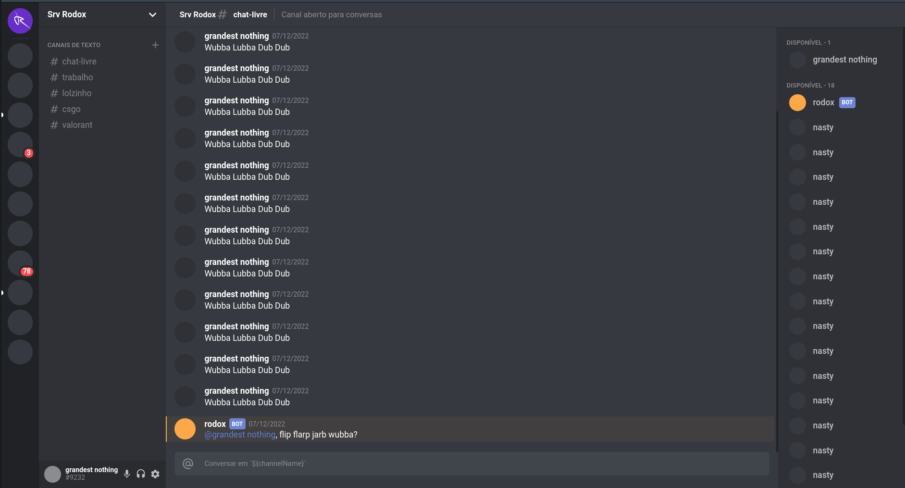

<h1 align="center"> Discord Clone Tuned </h1>

<h3 align="center">
  <a href="">Acesse Meu App</a>
</h3>

  

## 🚀 Tecnologias

Esse projeto foi desenvolvido com as seguintes tecnologias:

- React.js
- Styled Components
- TypeScript
- Git & GitHub

## 💻 Projeto

Criar um clone da interface do Discord, usando React.js.

## 💻 Uso

- Rodar yarn start e acessar http://localhost:3000
